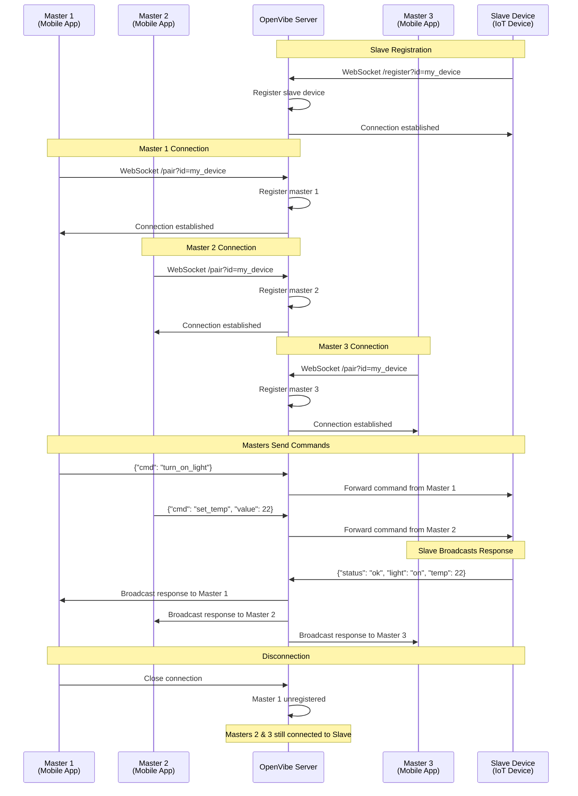

# OpenVibe-Server

A high-performance WebSocket server built in Rust that enables real-time bidirectional communication using a **Master-Slave** architecture. Multiple master clients (mobile apps) can connect to and control a single slave device, enabling efficient IoT control scenarios.

## Architecture Overview

- **Masters** (Multiple): Mobile applications or control clients that send commands
- **Slave** (Single per group): A device that receives commands from masters and sends responses
- **Many-to-One**: Multiple masters can connect to the same slave device concurrently

## Tech Stack

- **Rust** - Core language for performance and safety
- **Axum** - Modern async web framework with WebSocket support
- **Tokio** - Async runtime for concurrent connections
- **Tokio-Tungstenite** - WebSocket implementation
- **Serde** - JSON serialization/deserialization
- **Tracing** - Structured logging

## Description

OpenVibe-Server acts as a communication bridge in a Master-Slave model where:
- **Masters** (Mobile Apps): Multiple clients that send commands/requests to a slave device
- **Slave** (Device): A single device that receives commands from all connected masters and broadcasts responses to all of them

The server maintains persistent WebSocket connections and efficiently routes messages using Tokio's broadcast channels. It supports many-to-one connections with automatic cleanup of disconnected clients.

## API Endpoints

### Slave Registration (Device)
```
GET /register?id={device_id}
```
**Purpose**: Register a slave device that will receive commands from masters  
**Query Parameters**:
- `id` (required): Unique identifier for the device

### Master Connection (Mobile/App)
```
GET /pair?id={device_id}
```
**Purpose**: Connect a master (mobile app) to a slave device  
**Query Parameters**:
- `id` (required): Slave device ID to connect to

## Master vs Slave Architecture

- **Master** (`/pair?id={device_id}`): A mobile app or control client
  - Sends commands to the slave device
  - Receives responses/broadcasts from the slave
  - Multiple masters can connect to a single slave concurrently
  
- **Slave** (`/register?id={device_id}`): The controlled device
  - Receives commands from all connected masters
  - Can send responses/broadcasts to all connected masters
  - Only one slave per device ID

### Message Flow

```
Master 1 ──┐
Master 2 ──┼─→ Slave (Device) ──┬─→ Master 1 (Broadcast)
Master 3 ──┘                    ├─→ Master 2 (Broadcast)
                                └─→ Master 3 (Broadcast)
```

**Behavior**: 
- Masters send commands to slave (unicast)
- Slave broadcasts responses to all connected masters
- Masters do NOT communicate directly with each other

## Connection Flow



## Control Flow Diagram

```
Masters (Mobile Apps)
┌─────────────┐
│  Master 1   │ (sends commands)
│  (Phone)    │
└──────┬──────┘
       │
       │   Command         Response    ┌──────────────┐
       │ ─────────────────────────────→│ Slave Device │
┌──────┴──────┐                        │  (IoT Dev)   │
│  Master 2   │ (sends commands)       │              │
│  (Tablet)   │ ←─────────────────────→│ (Broadcast   │
└──────┬──────┘                        │  to all)     │
       │                               └──────────────┘
       │
┌──────┴──────┐
│  Master 3   │ (sends commands)
│  (Web App)  │
└─────────────┘

All masters receive broadcasted responses from the slave
```

## Installation & Deployment

### Using Docker (Recommended)

1. **Build the container**:
```bash
docker build -t openvibe-server .
```

2. **Run the container**:
```bash
docker run -p 3000:3000 openvibe-server
```

3. **Custom port**:
```bash
docker run -p 8080:8080 -e SERVER_PORT=8080 openvibe-server
```

### Local Development

1. **Install Rust** (if not installed):
```bash
curl --proto '=https' --tlsv1.2 -sSf https://sh.rustup.rs | sh
```

2. **Clone and run**:
```bash
git clone <repository-url>
cd OpenVibe-Server
cargo run
```

## Socket Implementation

### Slave Implementation (IoT Device)

```javascript
const WebSocket = require('ws');

const deviceId = 'my_device';
const ws = new WebSocket(`ws://localhost:3000/register?id=${deviceId}`);

ws.on('open', () => {
    console.log('Slave device connected and ready to receive commands from masters');
});

ws.on('message', (data) => {
    const command = JSON.parse(data.toString());
    console.log('Received command from master:', command);
    
    // Process command and send response/broadcast
    ws.send(JSON.stringify({ 
        status: 'executed',
        command: command.cmd,
        result: 'success',
        timestamp: Date.now()
    }));
});

ws.on('close', () => {
    console.log('Slave device disconnected');
});
```

### Master Implementation (Multiple Can Connect)

```javascript
const WebSocket = require('ws');

const deviceId = 'my_device';
const ws = new WebSocket(
    `ws://localhost:3000/pair?id=${deviceId}`
);

ws.on('open', () => {
    console.log('Master connected to device:', deviceId);
    // Send command to slave device
    ws.send(JSON.stringify({ 
        cmd: 'turn_on_light',
        intensity: 80
    }));
});

ws.on('message', (data) => {
    const response = JSON.parse(data.toString());
    console.log('Received response from slave device:', response);
});

ws.on('close', () => {
    console.log('Master disconnected from device');
});
```

### Connecting Multiple Masters to Same Slave

```javascript
// Multiple masters can connect freely
const masters = [];

for (let i = 1; i <= 3; i++) {
    const ws = new WebSocket(
        `ws://localhost:3000/pair?id=my_device`
    );
    
    ws.on('open', () => {
        console.log(`Master ${i} connected`);
        // Send command from this master
        ws.send(JSON.stringify({
            cmd: 'ping',
            from: `master_${i}`
        }));
    });
    
    ws.on('message', (msg) => {
        console.log(`Master ${i} received broadcast: ${msg}`);
    });
    
    masters.push(ws);
}

// All 3 masters are now connected to the same slave device and will receive
// broadcasts from it.
```

## Testing

Run the integration tests:
```bash
cargo test -- --nocapture
```

The test suite includes:
- **device_broadcasts_to_multiple_mobiles**: Verifies slave broadcasts responses to multiple masters
- **test_device_mobile_communication**: Smoke test for basic master-slave communication  
- **mobile_messages_do_not_go_to_other_mobiles**: Ensures masters do NOT communicate directly (only through slave)

## Configuration

- **SERVER_PORT**: Set via environment variable (default: 3000)
  ```bash
  SERVER_PORT=8080 cargo run
  ```
- **Docker**: Exposed on port 3000 by default
  ```bash
  docker run -p 3000:3000 openvibe-server
  ```

## Architecture

The server maintains a connection registry mapping device IDs to:
- **Slave sender**: Receives commands from all masters (and can send responses)
- **Master broadcast channel**: Distributes slave responses to all connected masters

Messages use Tokio's broadcast channels for efficient async routing:
- Masters → Slave: Direct unicast
- Slave → Masters: Broadcast to all subscribers

## License

MIT License