# OpenVibe-Server

A high-performance WebSocket server built in Rust that enables real-time bidirectional communication between IoT devices and mobile applications.

## Tech Stack

- **Rust** - Core language for performance and safety
- **Axum** - Modern async web framework with WebSocket support
- **Tokio** - Async runtime for concurrent connections
- **Tokio-Tungstenite** - WebSocket implementation
- **Serde** - JSON serialization/deserialization
- **Tracing** - Structured logging

## Description

OpenVibe-Server acts as a communication bridge between IoT devices and mobile applications. It maintains persistent WebSocket connections and routes messages between paired clients using a unique device ID system. The server supports concurrent connections and automatic cleanup of disconnected clients.

## API Endpoints

### Device Registration
```
GET /register?id={device_id}
```
**Purpose**: Register an IoT device for communication  
**Query Parameters**:
- `id` (required): Unique identifier for the device

### Mobile Pairing
```
GET /pair?id={device_id}
```
**Purpose**: Connect a mobile app to an existing device  
**Query Parameters**:
- `id` (required): Device ID to pair with (must match existing device)

## Device vs Mobile Difference

- **Device** (`/register`): The primary IoT device that initiates the connection
- **Mobile** (`/pair`): The mobile application that pairs with an existing device

Both use the same `device_id` to establish a communication channel. Messages sent from either client are automatically forwarded to its paired counterpart.

## Connection Flow

```mermaid
sequenceDiagram
    participant D as IoT Device
    participant S as OpenVibe Server
    participant M as Mobile App
    
    Note over D,M: Connection Setup
    D->>S: WebSocket /register?id=device123
    S->>S: Register device in connection registry
    S->>D: Connection established
    
    M->>S: WebSocket /pair?id=device123
    S->>S: Pair mobile with existing device
    S->>M: Connection established
    
    Note over D,M: Message Exchange
    D->>S: "Sensor data: temp=25°C"
    S->>M: Forward message to paired mobile
    
    M->>S: "Command: turn_on_led"
    S->>D: Forward message to paired device
    
    Note over D,M: Disconnection
    D->>S: Close connection
    S->>S: Remove device from registry
    
    M->>S: Close connection
    S->>S: Clean up connection pair
```



## Installation & Deployment

### Using Docker (Recommended)

1. **Build the container**:
```bash
docker build -t openvibe-server .
```

2. **Run the container**:
```bash
docker run -p 3000:3000 openvibe-server
```

3. **Custom port**:
```bash
docker run -p 8080:8080 -e SERVER_PORT=8080 openvibe-server
```

### Local Development

1. **Install Rust** (if not installed):
```bash
curl --proto '=https' --tlsv1.2 -sSf https://sh.rustup.rs | sh
```

2. **Clone and run**:
```bash
git clone <repository-url>
cd OpenVibe-Server
cargo run
```

## Socket Implementation

### Device Implementation (IoT Device)

```javascript
const WebSocket = require('ws');

const deviceId = 'your-unique-device-id';
const ws = new WebSocket(`ws://localhost:3000/register?id=${deviceId}`);

ws.on('open', () => {
    console.log('Device connected');
    // Send data to mobile app
    ws.send('Hello from device');
});

ws.on('message', (data) => {
    console.log('Received from mobile:', data.toString());
});

ws.on('close', () => {
    console.log('Device disconnected');
});
```

### Mobile App Implementation

```javascript
const WebSocket = require('ws');

const deviceId = 'your-unique-device-id'; // Same as device
const ws = new WebSocket(`ws://localhost:3000/pair?id=${deviceId}`);

ws.on('open', () => {
    console.log('Mobile app connected');
    // Send data to device
    ws.send('Hello from mobile');
});

ws.on('message', (data) => {
    console.log('Received from device:', data.toString());
});

ws.on('close', () => {
    console.log('Mobile app disconnected');
});
```

## Testing

Run the tests:
```bash
cargo test
```

## Configuration

- **SERVER_PORT**: Set via environment variable (default: 3000)
- **Docker**: Exposed on port 3000 by default

## Architecture

The server maintains a connection registry mapping device IDs to client pairs (device + mobile). Messages are automatically routed between paired clients using Tokio's broadcast channels for efficient async communication.

## License

MIT License